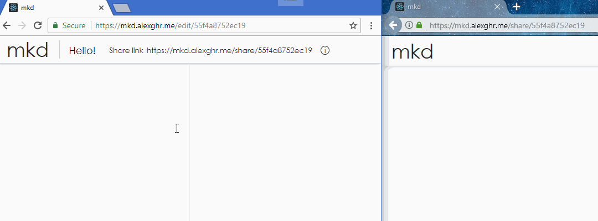

# mkd - Markdown editor with peer-to-peer sharing



You can try it at https://mkd.alexghr.me.

## About
mkd is a bare-bones, online Markdown editor that enables peer-to-peer sharing of the documents you write. Documents are stored locally in the browser thanks to `localStorage`. Sharing is achieved via WebRTC.

**Note** that no TURN server is configured so sharing works only if a direct connection between peers can be established. 😞

## Requirements
### Runtime
To run the webapp you need a modern browser:
- ✅ Chrome (desktop)
- ✅ Firefox (desktop)
- ✅ Chrome (mobile)
- ✅ Firefox (mobile)
- ⛔ Edge
- ⛔ Internet Explorer

To run the signaling server:
- Node.js v8+

### Development
1. install dependencies for both parts of the project
```bash
$ cd packages/signal
$ npm install
$ cd ../web
$ npm install
```
2. prepare environment
```bash
$ cp packages/signal/.env.sample packages/signal/.env
$ cp packages/web/.env.sample packages/web/.env
```
3. run the server in the background
```bash
$ cd packages/signal
$ npm start &
```
4. run webapp
```bash
$ cd packages/web
$ npm start
```

Your browser should open automatically with the webapp in a new tab. If it doesn't, go to `http://localhost:3000` in your browser.

## License
MIT
